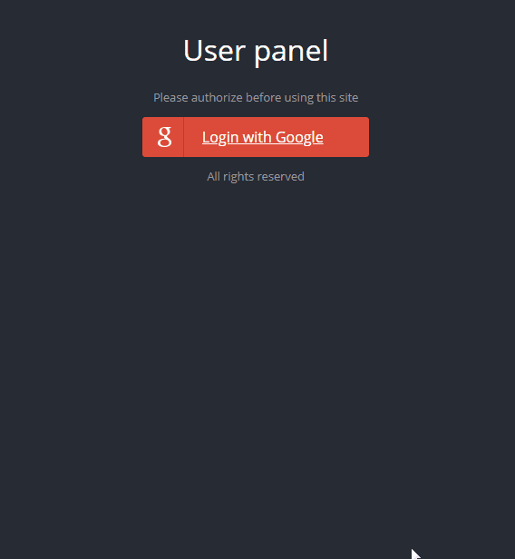

<p align="center">
<a href="https://github.com/grzegorz-jodlowski/login-OAuth"></a>
</p>


# <p align="center">🔐 Login OAuth</p>
<p align="center">Project for learning OAuth 2.0 standard</p>

</br>

## Table of Contents

- [What's this project about?](#about)
- [Technologies used](#tech)
- [What I learned?](#what)
- [Interesting code snippet](#inter)
- [Installation and quick start](#install)

</br>

## <a name="about"></a>What's this project about?

This is a simple login page using OAuth 2.0. The application uses login using a google account. After successful login, you are redirected to the user's profile (retrieves user data from the google account).


</br>

## <a name="tech"></a>Technologies used
- HTML
- Handlebars
- CSS
- JavaScript
- Express
- Passport
- Google API Console
- GIT

</br>

## <a name="what"></a>What I learned?

- what is the OAuth 2.0 protocol,
- when create your own login system (e.g. banking),
- use environment variables,
- use the Passport library for authorization,
- work with Google API Console,
- good practices in the context of application security:
  - hide sensitive data,
  - use strong non-obvious passwords,
  - as a server, don't trust what the client provides,
  - always validate data also on the server,
  - handle potential errors and inform the user in an understandable way,
  - thoroughly filter data entered into the database,
  - use sanitizers, e.g. Mongo-sanitize,
  - watch out for dependent packages,
  - use the Helmet package.


</br>

## <a name="inter"></a>Interesting code snippet (for me of course 😉)
- Passport config:

```js
const passport = require('passport');
const GoogleStrategy = require('passport-google-oauth20').Strategy;

// configure passport provider options
passport.use(new GoogleStrategy({
  clientID: process.env.clientID,
  clientSecret: process.env.clientSecret,
  callbackURL: process.env.callbackURL
}, (accessToken, refreshToken, profile, done) => {
  done(null, profile);
}));

// serialize user when saving to session
passport.serializeUser((user, serialize) => {
  serialize(null, user);
});

// deserialize user when reading from session
passport.deserializeUser((obj, deserialize) => {
  deserialize(null, obj);
});
```

- use Passport in `server.js` file:

```js
const passport = require('passport');
const session = require('express-session');
const passportConfig = require('./config/passport');

const app = express();

// init session mechanism
app.use(session({ secret: 'anything' }));

// init passport
app.use(passport.initialize());
app.use(passport.session());


...

```
- use Passport in endpoints:

```js
const express = require('express');
const passport = require('passport');
const router = express.Router();

router.get('/google',
  passport.authenticate('google', { scope: ['email', 'profile'] }));

router.get('/google/callback', passport.authenticate('google', { failureRedirect: '/user/no-permission' }),
  (req, res) => {
    res.redirect('/user/logged');
  }
);

module.exports = router;

```
- add environment variables in `nodemon.json` file:

```js
{
  "env": {
    "clientID": "...",
    "clientSecret": "...",
    "callbackURL": "..."
  }
}

```

</br>

## <a name="install"></a>Installation and quick start

- use the package manager [npm](https://www.npmjs.com/get-npm) or [yarn](https://classic.yarnpkg.com/en/) to install dependencies:

```bash
npm install // yarn install

or

npm i // yarn
```
- run server with nodemon (after nodemon installation):

```bash
npm start

or

yarn start
```
- open website on http://localhost:8000/


</br>
</br>

  *project implemented as part of the 9-month [Web Developer Plus](https://kodilla.com/pl/bootcamp/webdeveloper/?type=wdp&editionId=309) course organized by [Kodilla](https://drive.google.com/file/d/1AZGDMtjhsHbrtXhRSIlRKKc3RCxQk6YY/view?usp=sharing)
